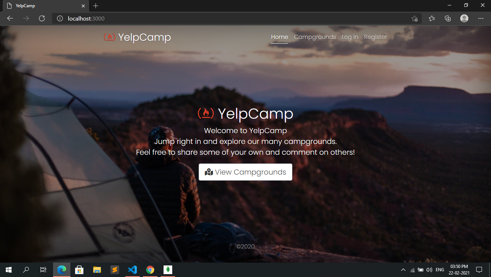
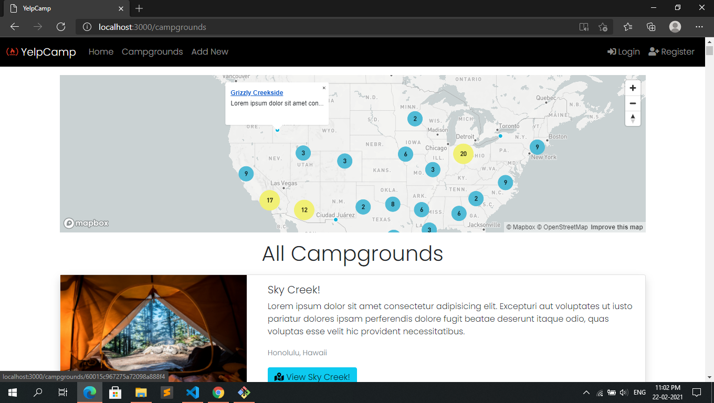
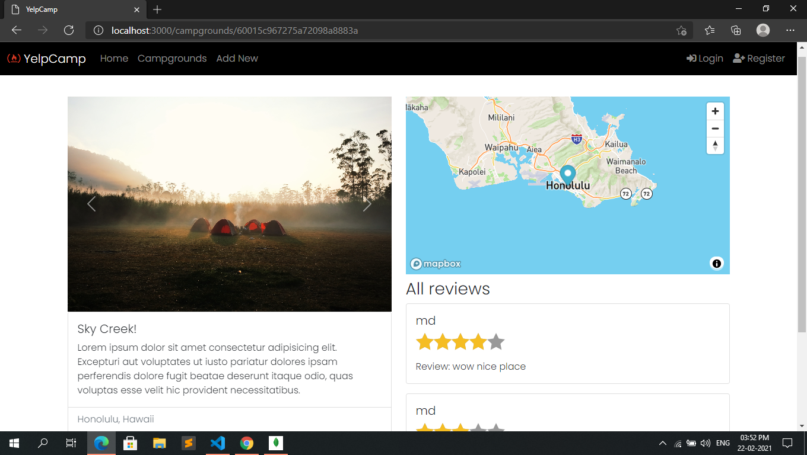
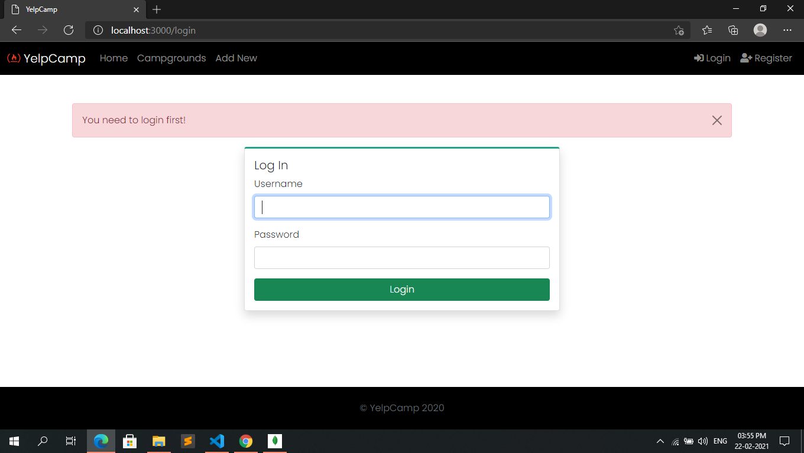

# yelpCamp
YelpCamp is a website where users can create and review campgrounds, also it has an integrated cluster map system. It has a fully functional user authentication
to review or create a campground. This project was part of Colt Steele's web dev course on udemy.

This project was created using Node.js, Express, MongoDB, and Bootstrap. Passport.js was used to handle authentication.

## Screenshot

